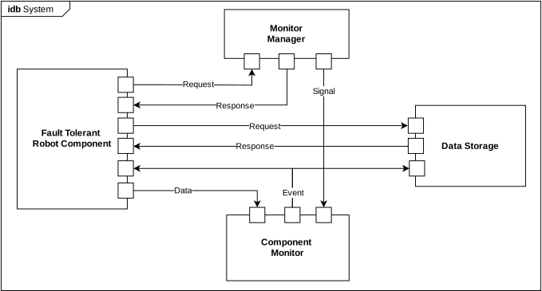

# Component State Machine

This project contains implementation of the abstract class `ComponentSMBase` which is used for creating fault tolerant robot components. A minimal working example of such component is provided within class `RGBDCameraSM`.
The fault tolerance of the component is based on two aspects:
* Use of the Fault Tolerant State Machine
* Direct communication with the monitoring mechanism provided in the repository **component_monitoring**.

## Usage
To run the fault tolerant RGBD camera, which is a minimal working example of the fault tolerant component, please use the below command:
```python
cd scripts
python run_rgbd_camera.py
```

## Explanation of communication with **component_monitoring**
Fault Tolerant Component is transferring data (e.g.: pointcloud) to the Component Monitoring with the use of ROS message bus. Respective monitors in the Component Monitoring part are monitoring the data and generating events into Kafka message bus. Those events are then received by the Fault Tolerant Component and an appriopriate reaction is performed.

Additionally, the Fault Tolerant Component is able to turn off/on the respective monitors. It is done by sending an appriopriate command to the Component Monitoring (more precisely `monitor_manager`).

The complete communication schema is depicted below with the Internal Block Diagram.



The messages sent within the Kafka message bus are in the form of JSON. There are two types of messages:

* general message - it that case it is used to send commands (`general.json`), the message is composed of the following fields:
  * `source_id` - unique id of the publisher (e.g. id of the component)
  * `target_id` - list of the ids of the receivers (e.g. ids of the monitors)
  * `type` - type of the message (e.g.: ack (acknowledgement), cmd (command))
  * `message`
    * `command` - command for the receiver (e.g. shutdown or activate), this field is used when the type of the message is `cmd`
    * `status` - status of the publisher performing the command (e.g.: success,failure, fatal), thie field is used when the type of the message is `ack`,
* event message - in that case specific format is used for the minimal working example (`monitoring.json`):
  * `monitorName` - name of the monitor that generated the event
  * `monitorDescription` - description of the monitor
  * `healthStatus`
    * `nans` - field indicating if the monitor considers the number of NaN values in the received point cloud (from the component) as too big (`true`) or as normal (`false`)

## Configuration

The Fault Tolerant Component needs to have assigned certain parameters which are depicted in the configuration file `config.yaml`. All of the parameters are explained below:

* `id` - unique id of the fault tolerant component
* `data_input_topics` - ROS topic from which the data is received by the component
* `data_output_topics` - ROS topic to which the data is put from the component
* `data_transfer_timeout` - if component can not publish data for this time, reconfiguration is activated (the unit is second)
* `pipeline_server` - address of the Kafka server
* `control_topic` - Kafka topic to switch on/off monitoring
* `monitors` - list of monitors that are monitoring the component, each monitor is defined by its unique `id` and `feedback_topic` from which the component is receiving information about its possible failure